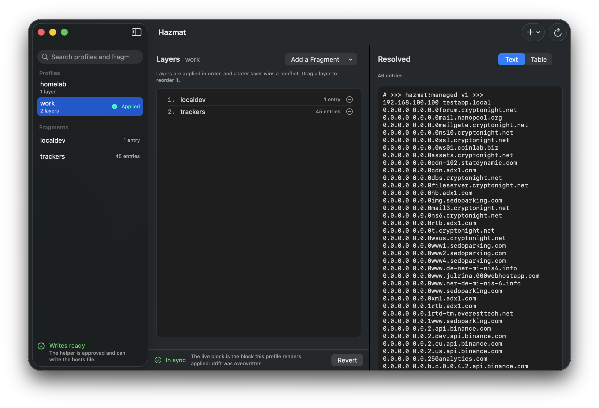

<div align="center">
  
  <h1>Hazmat</h1>
  <p><strong>A hosts file manager for Apple Silicon Macs.</strong></p>
  <p>
    <a href="https://github.com/greyshepherd/hazmat/releases/latest">Download</a> ·
    <a href="CHANGELOG.md">Changelog</a> ·
    <a href="LICENSE">MIT License</a>
  </p>
</div>

---

Hazmat keeps named profiles of hosts entries — local development overrides, a
tracker blocklist, a staging environment — and switches between them from the
menu bar. It is inspired from
[Gas Mask](https://github.com/2ndalpha/gasmask), written from scratch for
Apple Silicon.

<p align="center">
  
</p>

**Disclaimer**: This codebase was built entirely by pairing with an AI agent — no code was handwritten by a human.

## Installing

```
brew tap greyshepherd/tap
brew trust greyshepherd/tap
brew install --cask hazmat
```
On first apply, Hazmat offers to install its helper — the one step that needs
your password, and the only thing that gives it permission to write
`/etc/hosts`.

## Features

- **Profiles and fragments.** A profile is an ordered list of fragments —
  reusable blocks of entries shared between profiles. Later layers win
  conflicts.
- **Menu bar switcher.** The menu bar shows the current state at a glance and
  switches profiles without opening a window.
- **See it before it lands.** The window shows a profile's layers and the
  exact block they resolve to — as text or a table — before anything is
  written to `/etc/hosts`.
- **Applying is a review step.** A confirmation names the file and the entry
  count, the block it replaces is kept so the change can be reverted.
- **Drift detection.** The active profile is read back from the file's bytes,
  so an edit made outside Hazmat is reported as drift rather than silently
  overwritten.

## How it works

A profile's fragments resolve, in order, into a single block of entries between
`# >>> hazmat:managed v1 >>>` markers. A privileged helper — installed once
from the app, and which only accepts bytes signed by the same team — splices
that block into `/etc/hosts` and leaves every other line of the file untouched.
The app itself needs no privileges: profiles are edited in a plain folder on
disk (its location is choosable in Settings), and that store, not the hosts
file, is the source of truth. Switching profiles or turning the block off
restores the rest of the file exactly as it was.

Fragments are plain text, and a line is read the same whether it ends in `\n` or
`\r\n`. A block of a few hundred thousand short entries fits inside the helper's
16 MiB write bound. The store is read every time it is asked — a window refresh,
a click on the menu bar — and what was derived from a file is reused only while
the bytes read come back identical, so a fragment another tool changed is read
as it is now rather than as it was.

## Requirements

- A Mac with Apple silicon
- macOS 15 (Sequoia) or later

## Documentation

| Document | What it covers |
| --- | --- |
| [CHANGELOG.md](CHANGELOG.md) | What changed in each release |
| [BUILDING.md](BUILDING.md) | Build and test from source |
| [RELEASE.md](RELEASE.md) | Cutting and publishing a release (maintainers) |
| [CONTRIBUTING.md](CONTRIBUTING.md) | Reporting bugs and sending changes |

## License

[MIT](LICENSE) © Grey Shepherd
